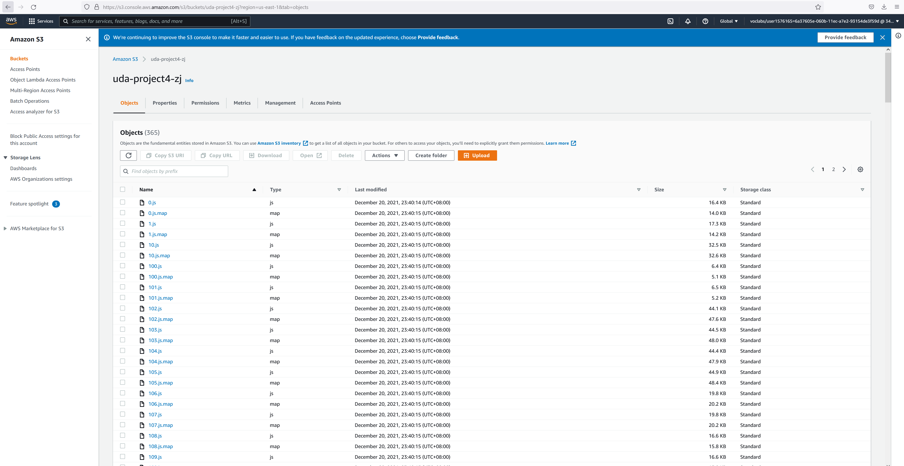

# Document

## Infrastructure
This application is hosted on AWS Cloud, involving 3 services:
1. RDS: data storage
2. S3 Bucket: frontend server and files storage
3. ELastic Beanstalk: API server

S3 endpoint: http://uda-project4-zj.s3-website-us-east-1.amazonaws.com/home

