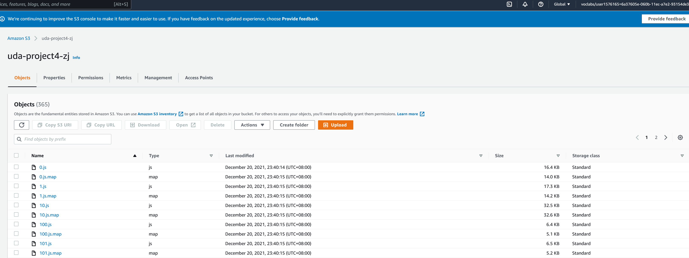
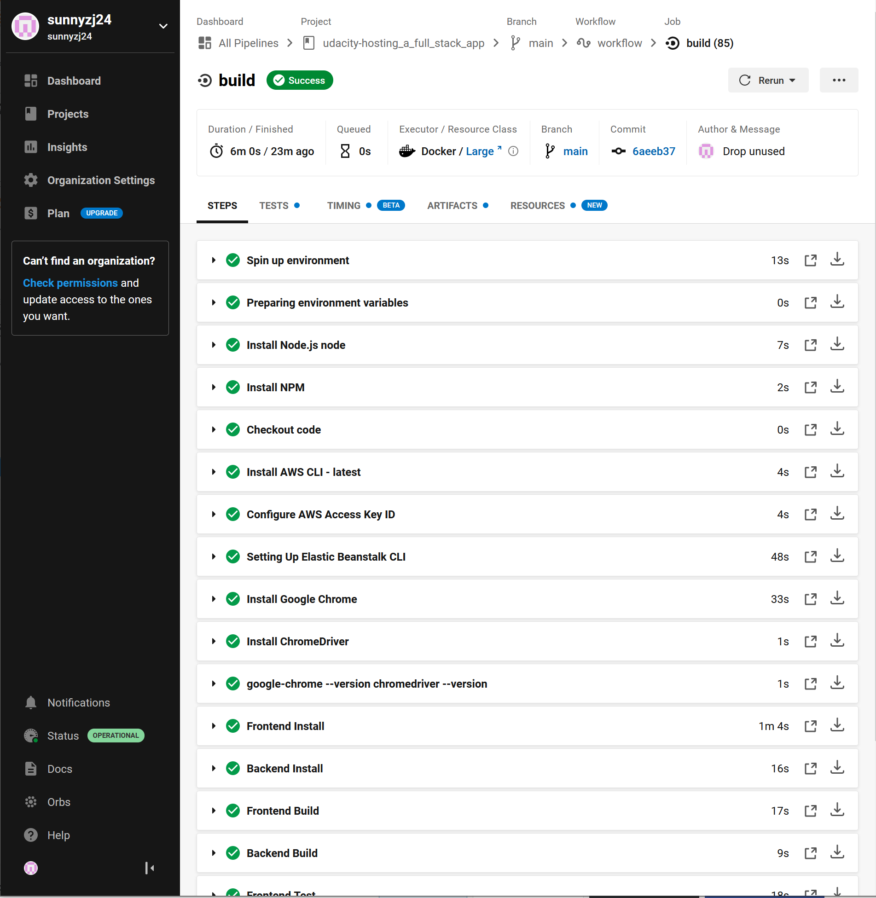

# Document

## Infrastructure
This application is hosted on AWS Cloud, involving 3 services:
1. RDS: data storage
2. S3 Bucket: frontend server and files storage
3. ELastic Beanstalk: API server

Appllication Architectrure
!

S3 endpoint: http://uda-project4-zj.s3-website-us-east-1.amazonaws.com/home

RDS

Elastic Beanstalk

## Pipenline
The CircleCI is associated with project in GitHub and can setup env, install lib, build app and deploy to AWS automatically when any code change in GitHub repository.

Workflow in pipeline:

Success build:

Env variables:
