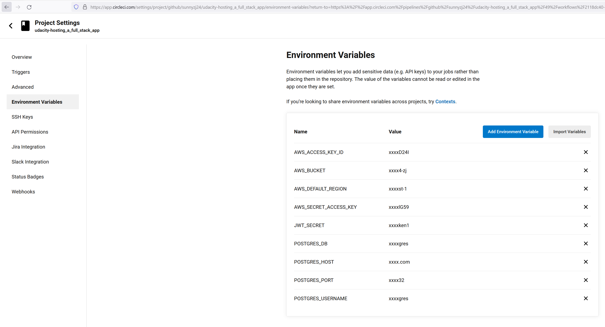

# Pipenline
The CircleCI is associated with project in GitHub and can setup env, install lib, build app and deploy to AWS automatically when any code change in GitHub repository.

## Workflow in pipeline:

## Success build:

## Env variables:
